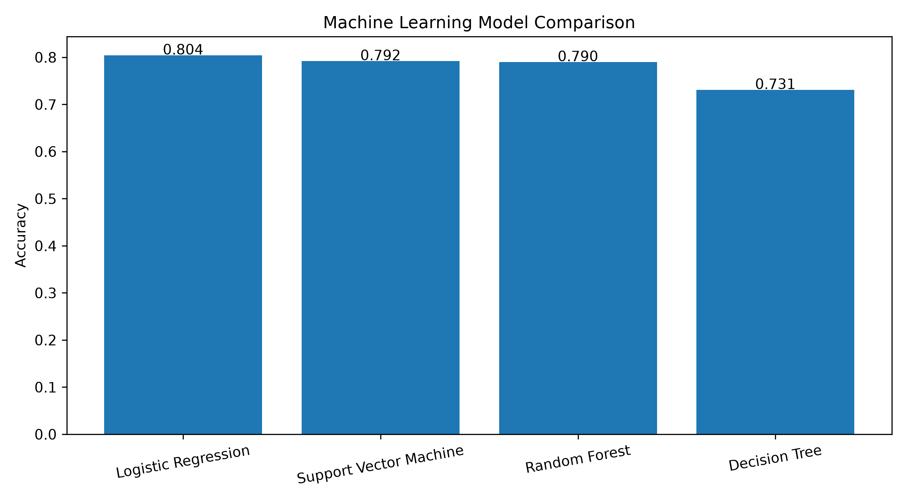
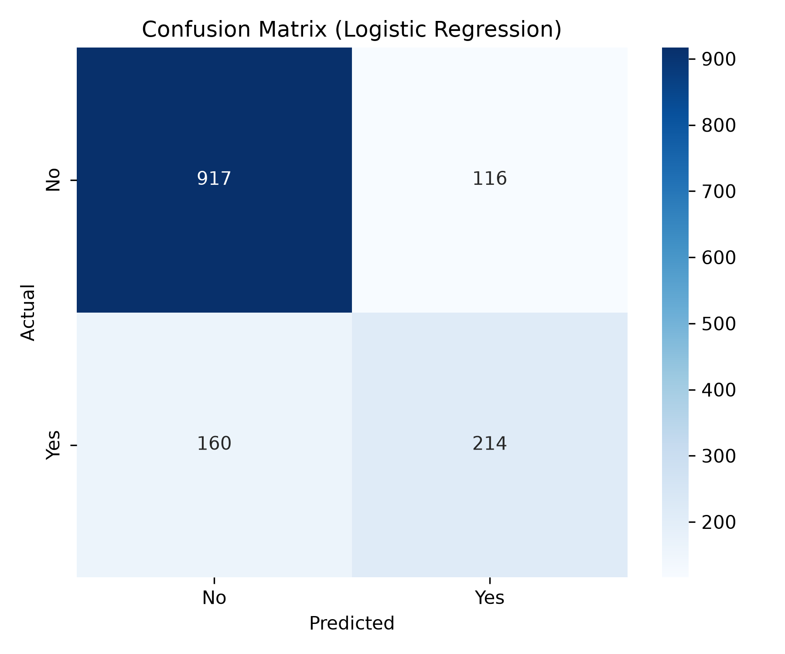
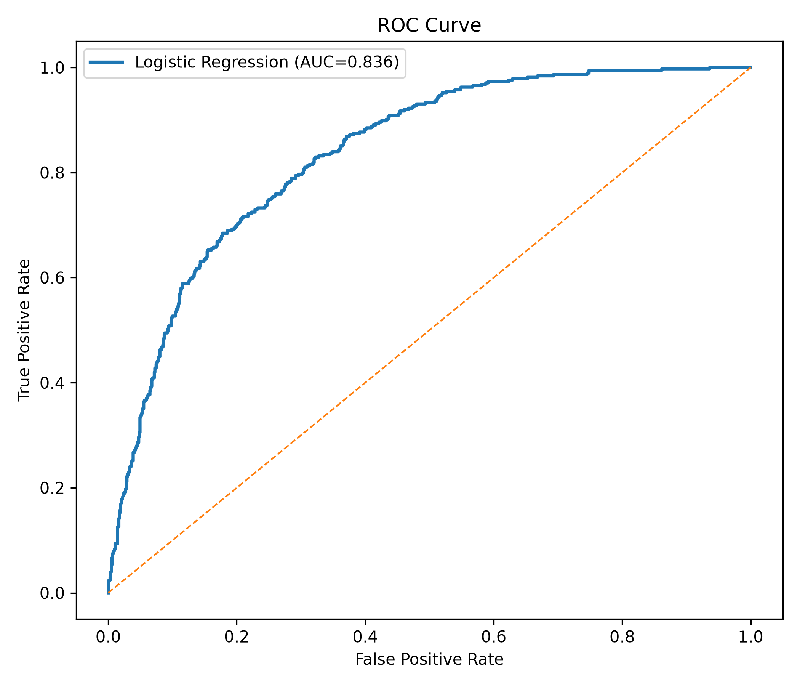

# 📊 Customer Churn Prediction System

A Machine Learning-based Customer Churn Prediction System developed to identify customers who are likely to discontinue telecommunication services. The system utilizes supervised machine learning algorithms to analyse customer demographics, subscribed services, billing information, and account details to support proactive customer retention strategies.

---

# 📌 Overview

Customer churn is one of the major challenges faced by telecommunication companies. Predicting potential customer churn enables organizations to implement timely retention strategies, improve customer satisfaction, and reduce revenue loss.

This project performs:

- Data Preprocessing
- Feature Engineering
- Machine Learning Model Training
- Model Evaluation
- Data Visualization
- Customer Churn Prediction using Streamlit

---

# 🎯 Objectives

- Predict customers who are likely to churn.
- Compare multiple Machine Learning algorithms.
- Evaluate model performance using standard classification metrics.
- Develop an interactive web application for real-time prediction.
- Support business decision-making through predictive analytics.

---

# 📂 Dataset

**Dataset:** IBM Telco Customer Churn Dataset

- Total Records : **7,043**
- Records after preprocessing : **7,032**
- Features : **20**
- Target Variable : **Churn**

---

# 🛠 Technologies Used

- Python
- Scikit-learn
- Pandas
- NumPy
- Matplotlib
- Seaborn
- Streamlit
- Joblib
- Visual Studio Code
- Git
- GitHub

---

# 🤖 Machine Learning Algorithms

- Logistic Regression
- Decision Tree
- Random Forest
- Support Vector Machine (SVM)

---

# 📈 Model Performance

| Machine Learning Model | Accuracy |
|------------------------|----------|
| **Logistic Regression** | **80.38%** |
| Support Vector Machine | 79.18% |
| Random Forest | 78.96% |
| Decision Tree | 73.06% |

### 🏆 Best Performing Model

**Logistic Regression**

Accuracy : **80.38%**

ROC-AUC : **0.8359**

---

# 📁 Project Structure

```text
Customer-Churn-Prediction
│
├── dataset/
│   └── Telco-Customer-Churn.csv
│
├── models/
│   └── best_model.pkl
│
├── results/
│   ├── Figure_6_1_Customer_Churn_Distribution.png
│   ├── Figure_6_2_Gender_Distribution.png
│   ├── Figure_6_3_Contract_Distribution.png
│   ├── Figure_6_4_Internet_Service.png
│   ├── Figure_6_5_Monthly_Charges_Distribution.png
│   ├── Figure_6_6_Tenure_Distribution.png
│   ├── Figure_6_7_Churn_by_Contract.png
│   ├── Figure_6_8_Churn_by_Internet_Service.png
│   ├── Figure_6_9_Correlation_Heatmap.png
│   ├── Figure_6_10_Model_Accuracy_Comparison.png
│   ├── Figure_6_11_Confusion_Matrix.png
│   ├── Figure_6_12_ROC_Curve.png
│   ├── classification_report.txt
│   ├── model_comparison.csv
│   ├── accuracy_comparison.png
│   ├── confusion_matrix.png
│   └── roc_curve.png
│
├── app.py
├── train_model.py
├── generate_charts.py
├── requirements.txt
├── README.md
└── .gitignore
```

---

# ⚙ Installation Guide

## Clone the Repository

```bash
git clone https://github.com/itzmemsd/Customer-Churn-Prediction.git
```

## Navigate to the Project Folder

```bash
cd Customer-Churn-Prediction
```

## Create a Virtual Environment

```bash
python -m venv venv
```

## Activate Virtual Environment

### Windows

```bash
venv\Scripts\activate
```

### Install Required Packages

```bash
pip install -r requirements.txt
```

---

# 🚀 Running the Project

## Train the Machine Learning Models

```bash
python train_model.py
```

## Generate Charts

```bash
python generate_charts.py
```

## Run the Streamlit Application

```bash
python -m streamlit run app.py
```

---

# 📊 Project Outputs

The project automatically generates:

- Trained Machine Learning Model (`best_model.pkl`)
- Model Comparison Report
- Classification Report
- Confusion Matrix
- ROC Curve
- Accuracy Comparison Chart
- Customer Churn Visualization Charts
- Correlation Heatmap
- Prediction Dashboard

---

# 📷 Screenshots

## Model Accuracy Comparison



---

## Confusion Matrix



---

## ROC Curve



---

# 🔮 Future Enhancements

- Hyperparameter Optimization
- XGBoost Implementation
- LightGBM Implementation
- Deep Learning Models
- Explainable AI (XAI)
- Interactive Business Intelligence Dashboard
- Cloud Deployment
- CRM Integration
- Real-Time Customer Churn Prediction
- REST API Integration

---

# 👨‍🏫 Author

## **Dr. M. Sasidharan**

**Associate Professor**

**Department of Management Studies**

**Shikshaa Institute of Advanced Technologies**

Chengalpattu, Tamil Nadu, India – 603 108

---

# 🌐 Connect with Me

**GitHub**

https://github.com/itzmemsd

**LinkedIn**

https://www.linkedin.com/in/itzmemsd

---

# 📄 License

This project is developed for **academic, educational, and research purposes**.

---

## ⭐ Support

If you found this project useful, please consider **starring ⭐ the repository** on GitHub.

Your support is greatly appreciated and encourages further research and development.